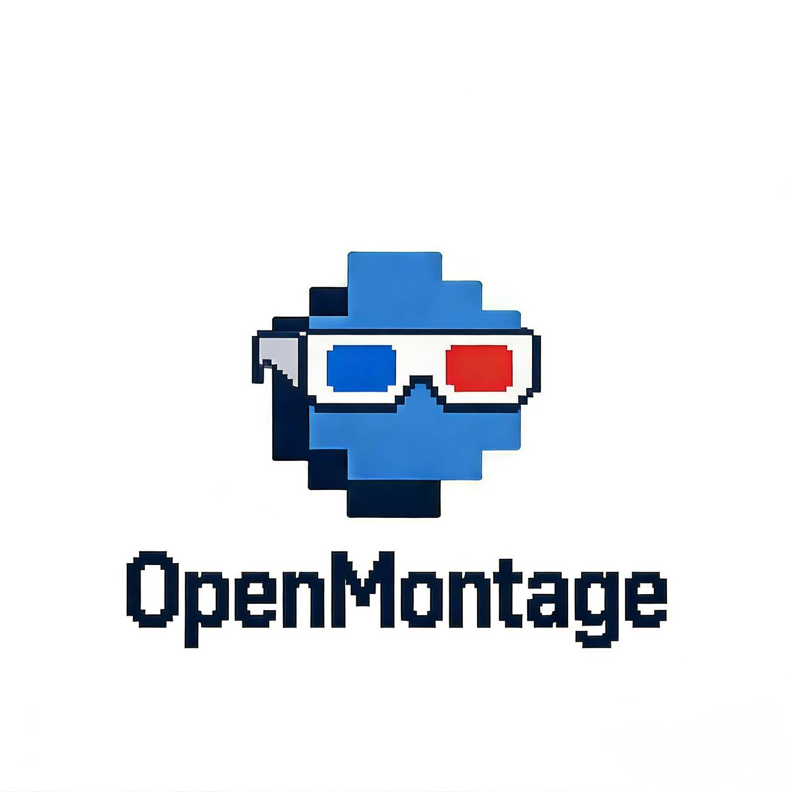

# OpenMontage

  

**Open-source collaborative filmmaking**

OpenMontage is a GitHub-inspired platform for creating videos through community collaboration. Just as developers contribute code to open-source projects, creators can contribute video segments to collaborative films.

## Vision

In the age of AI, anyone can create video segments and blend them seamlessly with others' work. With enough contributors, even a simple script can become a polished, professional-looking film through the collective creativity of the community.

## How It Works

1. **Script Foundation** — A screenplay is broken down into multiple segments
2. **Community Contribution** — Contributors create video clips for each segment (using AI generation tools, filming, or other methods)
3. **Voting & Selection** — The community votes on different versions of each segment
4. **Automated Assembly** — The highest-rated segments are combined into a complete film
5. **Iterative Improvement** — As more contributors join, the final video evolves and improves over time

## Contributing

We welcome contributions of all kinds — video segments, scripts, tooling, and ideas. See our documentation for more details.

## License

Apache License 2.0
