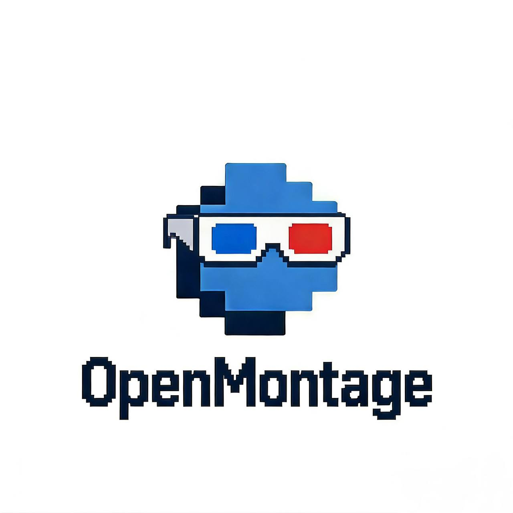

# OpenMontage

  

**Git for Movies**

OpenMontage lets anyone contribute to films like developers contribute to open-source projects. Upload a script, break it into shots, and watch the community create segments. The best work gets merged, creators earn based on screen time, and films evolve as better versions replace old ones.

---

## The Problem

AI tools can generate video now, but collaborative AI filmmaking doesn't work yet:

- **Everyone's protagonist looks different** — 10 creators, 10 different faces
- **No reason to contribute** — video generation costs money and time
- **Films stay frozen** — can't improve after release, even when AI gets better

---

## How We Solve It

### Standard Library
Every film ships with dependencies (like npm, but for movies):
- Character LoRA models → everyone's protagonist looks identical
- Style guides → consistent lighting and color
- Voice models → same voice across all segments

Pull the library, generate your segment, submit a PR. Simple.

### Crypto Economics
- Each segment = NFT with authorship proof
- 80% of revenue flows to creators based on screen time
- Better segment replaces yours? Revenue shifts to them
- Keep competing, keep earning

---

## Quick Start

**For Filmmakers:**
1. Upload script, split into shots
2. Train character LoRAs, build your Standard Library
3. Launch the repo, let creators work

**For Contributors:**
1. Find a film, claim a shot
2. Download the Standard Library
3. Generate video (Sora, Runway, whatever)
4. Submit → get minted as Clip NFT

**For Everyone:**
Vote on segments. Best one wins. Earn 5% of revenue for curating.

---

## Revenue Split

| Who | Share | How |
|-----|-------|-----|
| Creators | 80% | Per-second streaming payment while segment is active |
| Filmmaker | 15% | Built the foundation (script + Standard Library) |
| Curators | 5% | Voted to select best segments |

**Example:** 30-second segment in a film earning $10k/month → **$44/month** passive income (until someone beats you).

---

## Why This Works

**Standard Library** = first platform solving AI consistency  
**Streaming revenue** = earn continuously, not one-time payment  
**Version control** = films improve forever as tech advances  
**On-chain** = transparent ownership and payments

Read the details:
- [Product Mechanism](doc/product-mechanism.md) — how the system works
- [Tokenomics](doc/tokenomics.md) — economics and incentives  
- [Whitepaper](doc/whitepaper.md) — technical architecture

---

## Use Cases

- Indie films crowdsourced globally
- Fan projects (Shakespeare, public domain adaptations)
- Music videos with consistent art style
- Educational content built segment-by-segment
- Corporate videos at scale

---

## Contributing

We need:
- Video creators (claim shots, generate segments)
- Asset builders (train LoRAs, make ControlNets)
- Developers (platform, smart contracts, tooling)
- Writers (docs, translations)

---

## License

Apache 2.0

---

**This is Airbnb for film production. Contribute talent, earn revenue, own your work.**

Links coming soon: Website • Discord • Twitter
